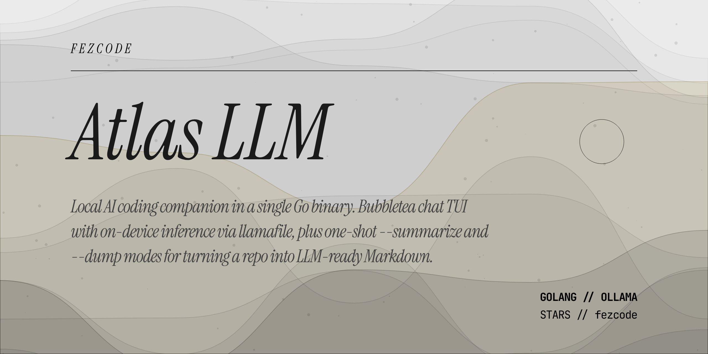

# atlas.llm



A local AI coding companion in a single Go binary. Opens an interactive chat
TUI by default — or, in one shot, summarizes a directory, runs semantic grep
across it, or compiles it into a single Markdown context file for hosted
LLMs. Inference runs fully on-device via the
[`llama.cpp`](https://github.com/ggml-org/llama.cpp) prebuilt `llama-cli`;
model weights and the engine are fetched on demand via an explicit
`/download` command. `/download engine` always pulls the latest llama.cpp
release for your OS/arch.

## Modes

### 1. Interactive chat (default)

```powershell
atlas.llm
```

Launches a terminal UI (bubbletea) with the currently selected local model.
Assistant replies are rendered with [glamour](https://github.com/charmbracelet/glamour)
so markdown — code fences, lists, tables — is styled inline. Dependencies
(engine + model) are **not** downloaded automatically — run `/download`
inside chat to fetch them. Sending a message or running `/summarize` while
they are missing returns an error with the command to run.

**Slash commands inside chat:**

| Command           | What it does                                                        |
| ----------------- | ------------------------------------------------------------------- |
| `/help`           | Show in-app help.                                                   |
| `/list`           | List known models and their download status (`*` = current).        |
| `/model`          | Open the model picker (↑/↓ + Enter), or `/model <name>` to switch.  |
| `/download`       | Download engine + current model.                                    |
| `/download engine`| Download only the inference engine.                                 |
| `/download <name>`| Download engine + the named model (does not switch to it).          |
| `/download all`   | Download engine + every model in the registry.                      |
| `/summarize`      | Summarize the current directory into `SUMMARY.md`.                  |
| `/grep <query>`   | Semantic grep: ask the local model to find lines matching `<query>`.|
| `/set [k [v]]`    | List or change persistent settings (currently: `max_tokens`).       |
| `/tools [on\|off\|list]` | Toggle agentic tool-use (off by default). See below.         |
| `/clear`          | Clear on-screen chat history (keeps conversation context).          |
| `/reset`          | Drop conversation context and the server KV cache.                  |
| `/quit`, `/exit`  | Leave chat (Ctrl+C also works).                                     |

Keys: `Enter` sends, `Shift+Enter` newline, `Tab` completes slash commands
and their arguments (model names, `/set` keys, `/download` targets), `Ctrl+Y`
copies the last assistant reply to the clipboard, `Ctrl+C` quits.

### 2. `--summarize` — project summary to SUMMARY.md

Walks the target directory (default: `.`), generates a 1-3 sentence summary
for every text file using the currently selected local model, and writes the
result to `SUMMARY.md` in that directory. Respects `.gitignore`.

```powershell
atlas.llm --summarize
atlas.llm --summarize ./src
```

This is the one-shot equivalent of running `/summarize` inside chat. It does
**not** include raw file contents — only the AI-generated summaries.

### 3. `--grep` — semantic code search

Walks the target directory and asks the local model to identify lines
matching a natural-language query. Prints `path:line: snippet` for each hit.
Respects `.gitignore`.

```powershell
atlas.llm --grep "where we load the gitignore"
atlas.llm --grep "download progress callback" ./src
atlas.llm --grep "retry logic" --max-size 65536
```

Unlike regex grep, queries can describe intent (`"retry logic with
backoff"`) rather than exact tokens. Accuracy depends on the selected
local model.

| Flag         | Default | Purpose                                              |
| ------------ | ------- | ---------------------------------------------------- |
| `--max-size` | `32768` | Skip files larger than this many bytes. Keeps per-file prompts under the OS command-line limit on Windows. |

### Agentic tool-use

Enable with `/tools on` inside chat. When enabled, the model can call a
small set of filesystem + shell tools to inspect or change the project
before replying. Destructive tools prompt for approval in a confirm modal
before they run.

| Tool         | Destructive | Purpose                                                         |
| ------------ | ----------- | --------------------------------------------------------------- |
| `read_file`  |             | Read a UTF-8 file.                                              |
| `list_dir`   |             | List entries in a directory.                                    |
| `grep`       |             | RE2 regex search across files under a directory.                |
| `write_file` | ✓           | Overwrite a file with new contents.                             |
| `edit_file`  | ✓           | Replace one unique occurrence of `old_string` with `new_string`.|
| `run_cmd`    | ✓           | Execute a shell command (30s timeout).                          |

Caveats:
- **Model capability matters.** Qwen3.5-9B and Ministral-3-14B handle
  tool-calling reliably. Gemma 3 (1B/4B) often ignores or hallucinates
  tool shapes — the feature will feel broken on those models.
- **No persistent tool loop across sessions.** `/reset` clears the agent
  message list alongside the regular conversation.
- **The confirm modal is synchronous.** The agent loop pauses while it's
  open; press Enter to approve, Esc (or select Deny) to reject. Denials
  are fed back to the model as a tool error so it can adapt rather than
  retry.

### 5. `-c` / `--chat` — one-shot non-interactive chat

Send a single prompt to the local model, print the reply to stdout, and
exit. No history is kept between calls — useful for shell pipelines and
scripting. Same dependency requirement as `--summarize` / `--grep`
(engine + selected model must already be downloaded).

```powershell
atlas.llm -c "explain goroutines in one paragraph"
atlas.llm -c "summarize this commit" < (git show HEAD)
git diff | atlas.llm -c -
```

Pass `-` as the prompt (or omit the value entirely when piping) to read
the prompt from stdin.

### 6. `--dump` — full project context to Markdown

Compiles every text file under the target directory into a single Markdown
document, with syntax-highlighted fenced code blocks. Intended for pasting
into hosted LLMs (Claude, Gemini, ChatGPT). Respects `.gitignore` and skips
binary files automatically.

```powershell
atlas.llm --dump
atlas.llm --dump -o context.md ./src
atlas.llm --dump --exclude .mp4,.mp3
atlas.llm --dump --with-summaries        # inline AI summaries per file
```

| Flag              | Default               | Purpose                                              |
| ----------------- | --------------------- | ---------------------------------------------------- |
| `-o`, `--output`  | `project_context.md`  | Output path.                                         |
| `--exclude`       | —                     | Comma-separated extra extensions to exclude.         |
| `--with-summaries`| off                   | Prepend each file's content with an AI summary block.|

## Top-level flags

| Flag               | Purpose                          |
| ------------------ | -------------------------------- |
| `-h`, `--help`     | Show help.                       |
| `-v`, `--version`  | Print version.                   |
| `--summarize`      | Run summary-to-`SUMMARY.md` mode.|
| `--grep QUERY`     | Run semantic grep mode.          |
| `--dump`           | Run directory-to-Markdown mode.  |
| `-c`, `--chat PROMPT` | One-shot chat — print reply and exit. `-` reads from stdin. |
| `--clear-logs`     | Delete the persistent TUI log file and exit. |

## Data directory

All downloaded artifacts and the config file live under
`~/.atlas/atlas.llm.data/`:

```
~/.atlas/atlas.llm.data/
├── config.json           # { "current_model": "gemma-3-1b-it" }
├── engine/               # extracted llama.cpp release (llama-cli + libs)
└── models/
    └── <model>.gguf      # model weights (fetched by /download)
```

## Available models

Models in the registry (`/list` shows download status):

- `gemma-3-1b-it` (~700MB, default) — small, widely compatible.
- `gemma-3-4b-it` (~2.5GB) — middle ground between 1B and 9B+.
- `gemma-4-e2b-it` (~2.9GB) — newer architecture; may crash on some llama.cpp builds.
- `qwen3.5-9b` (~5.7GB)
- `ministral-3-14b-instruct` (~8.2GB)

More can be added by extending `availableModels` in `config.go`.

## Conversation context

Within a running chat session, the full turn history is replayed into every
prompt — so multi-turn follow-ups work. Two caveats:

- **Not persisted.** `/clear` or exiting the chat discards history. Nothing
  is written to disk.
- **No compaction.** The prompt grows linearly with the conversation. Once
  you cross the model's context window it will silently truncate.

One-shot commands (`--summarize`, `--grep`, `--dump --with-summaries`) are
stateless — each file is processed in isolation.

## Building from source

The canonical build uses [gobake](https://github.com/fezcode/gobake) with the
repo's `Recipe.go` + `recipe.piml`:

```powershell
gobake build
```

Plain `go build` also works if you'd rather not install gobake:

```powershell
go build -o build/atlas.llm.exe .
```

## License

MIT — see [LICENSE](LICENSE).
