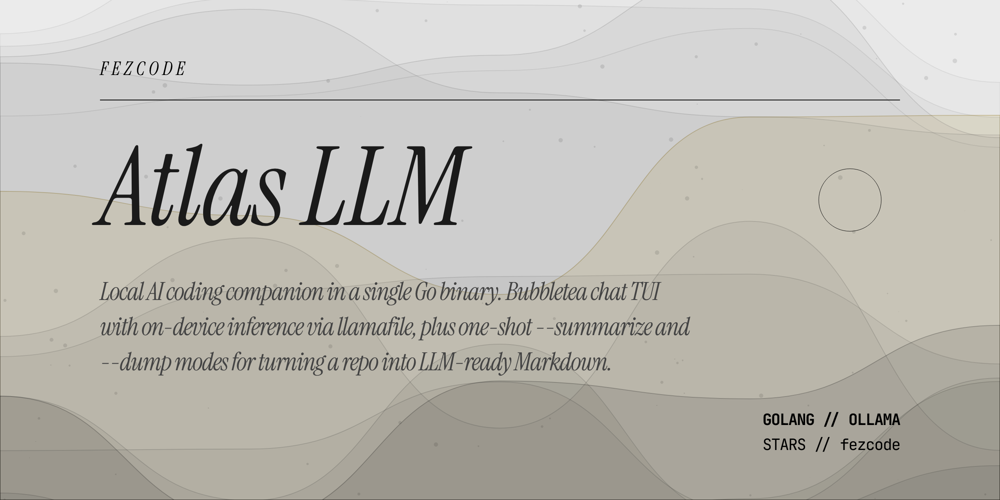

# atlas.llm



A local AI coding companion in a single Go binary. Opens an interactive chat
TUI by default — or, in one shot, summarizes a directory, runs semantic grep
across it, or compiles it into a single Markdown context file for hosted
LLMs. Inference runs fully on-device via the
[`llama.cpp`](https://github.com/ggml-org/llama.cpp) prebuilt `llama-cli`;
model weights and the engine are fetched on demand via an explicit
`/download` command. `/download engine` always pulls the latest llama.cpp
release for your OS/arch.

## Modes

### 1. Interactive chat (default)

```powershell
atlas.llm
```

Launches a terminal UI (bubbletea) with the currently selected local model.
Replies stream as they are generated, so you see the first words in about a
second rather than waiting for the whole answer. Reasoning models show a
`thinking…` indicator while they work, and `Esc` stops a reply mid-flight
while keeping whatever has arrived.
Assistant replies are rendered with [glamour](https://github.com/charmbracelet/glamour)
so markdown — code fences, lists, tables — is styled inline. Dependencies
(engine + model) are **not** downloaded automatically — run `/download`
inside chat to fetch them. Sending a message or running `/summarize` while
they are missing returns an error with the command to run.

**Slash commands inside chat:**

| Command           | What it does                                                        |
| ----------------- | ------------------------------------------------------------------- |
| `/help [cmd [sub]]` | Command overview, or full detail for one command/subcommand.       |
| `/list`           | List known models and their download status (`*` = current).        |
| `/model`          | Open the model picker (↑/↓ + Enter), or `/model <name>` to switch.  |
| `/download`       | Download engine + current model.                                    |
| `/download engine`| Download only the inference engine.                                 |
| `/download <name>`| Download engine + the named model (does not switch to it).          |
| `/download all`   | Download engine + every model in the registry.                      |
| `/summarize`      | Summarize the current directory into `SUMMARY.md`.                  |
| `/grep <query>`   | Semantic grep: ask the local model to find lines matching `<query>`.|
| `/set [k [v]]`    | Settings: `max_tokens`, `reasoning`, `max_tool_rounds`, `ctx_size`, `gpu_layers`, `engine_variant`, `endpoint`. |
| `/config`         | Everything at once: settings, session state, memory, paths.         |
| `/tools [on\|off\|list]` | Toggle agentic tool-use (off by default). See below.         |
| `/mcp [...]`      | Connect MCP servers (Slack, Confluence, …). See below.              |
| `/compact`        | Summarize older turns to free up the context window.                |
| `/yesman [on\|off]` | Auto-approve destructive tools — session only. See below.          |
| `/clear`          | Clear on-screen chat history (keeps conversation context).          |
| `/reset`          | Drop conversation context and the server KV cache.                  |
| `/quit`, `/exit`  | Leave chat (Ctrl+C also works).                                     |

Keys: `Enter` sends, `Shift+Enter` newline, `Tab` completes slash commands
and their arguments (model names, `/set` keys, `/download` targets), `↑`/`↓`
recall previous and next input, `Esc` stops a generation in progress,
`Ctrl+Y` copies the last assistant reply to the clipboard, `Ctrl+C` quits.

Input recall works like a shell: `↑` walks back through what you've sent,
`↓` walks forward, and a half-typed line is parked and restored when you
come back. Inside a multi-line draft the arrows move the cursor as usual —
recall only takes over at the first and last line.

### 2. `--summarize` — project summary to SUMMARY.md

Walks the target directory (default: `.`), generates a 1-3 sentence summary
for every text file using the currently selected local model, and writes the
result to `SUMMARY.md` in that directory. Respects `.gitignore`.

```powershell
atlas.llm --summarize
atlas.llm --summarize ./src
```

This is the one-shot equivalent of running `/summarize` inside chat. It does
**not** include raw file contents — only the AI-generated summaries.

### 3. `--grep` — semantic code search

Walks the target directory and asks the local model to identify lines
matching a natural-language query. Prints `path:line: snippet` for each hit.
Respects `.gitignore`.

```powershell
atlas.llm --grep "where we load the gitignore"
atlas.llm --grep "download progress callback" ./src
atlas.llm --grep "retry logic" --max-size 65536
```

Unlike regex grep, queries can describe intent (`"retry logic with
backoff"`) rather than exact tokens. Accuracy depends on the selected
local model.

| Flag         | Default | Purpose                                              |
| ------------ | ------- | ---------------------------------------------------- |
| `--max-size` | `32768` | Skip files larger than this many bytes. Keeps per-file prompts under the OS command-line limit on Windows. |

### `--reset-model` — unstick a heavy model

atlas.llm loads the selected model at startup. Quitting while a large model
is active means the next launch blocks loading it again, with no chance to
reach `/model` from inside the TUI.

```
atlas.llm --reset-model
```

Switches to the lightest model in the registry and exits. Other settings are
left alone.

`/list` and the `/model` picker show each model's weights as a share of
system RAM, so it's visible which ones your machine can hold before you
download one.

### Agentic tool-use

Enable with `/tools on` inside chat. When enabled, the model can call a
small set of filesystem, shell and web tools to inspect or change the
project before replying. Destructive tools prompt for approval in a confirm
modal before they run.

Edits are partial by default: `edit_file` and `multi_edit` replace matched
strings and leave the rest of the file alone. Only `write_file` rewrites a
whole file.

| Tool         | Destructive | Purpose                                                         |
| ------------ | ----------- | --------------------------------------------------------------- |
| `read_file`  |             | Read a UTF-8 file.                                              |
| `list_dir`   |             | List entries in a directory.                                    |
| `grep`       |             | RE2 regex search across files under a directory.                |
| `write_file` | ✓           | Overwrite a file with new contents.                             |
| `edit_file`  | ✓           | Replace one unique occurrence of `old_string` with `new_string`.|
| `multi_edit` | ✓           | Apply several edits to one file atomically — all or nothing.    |
| `run_cmd`    | ✓           | Execute a shell command (30s timeout).                          |
| `web_fetch`  | ✓           | Read one web page as text (20s timeout).                        |
| `browser_open` | ✓         | Launch a visible Chrome or Firefox window the model can drive.  |
| `browser_navigate` |       | Load a URL in that window and return the page's title + text.   |
| `browser_read` |           | Read the current page: visible text, links, or raw HTML.        |
| `browser_act`  |           | Click, type, hover, select, scroll, wait, go back/forward, run JS — target by visible text or CSS. |
| `browser_close`|           | Close the window and discard its profile.                       |

`web_fetch` needs confirmation because it is outbound, not because it
changes anything. It strips navigation and boilerplate, keeps links absolute
so the model can follow one, and reads text formats only — it does not run
JavaScript, so a page that assembles itself in the browser comes back empty
and says why. For pages that do need JavaScript — or anything interactive —
use the browser tools below instead.

It reaches the **public internet only**. Loopback, LAN and link-local
addresses are refused, and the check runs against the IP actually being
dialled — so it holds at every redirect hop, not just the URL you approved.
Pointing it at your own dev server will not work, by design; the URL in a
tool call comes from a model reading text it did not write.

#### Browser control

`browser_open` launches a real, headed browser window — you watch every page
it visits. Chrome, Chromium, and Edge are driven over the DevTools protocol;
Firefox over WebDriver BiDi. No driver binaries (chromedriver/geckodriver)
are needed. The window runs on a **fresh throwaway profile**: none of your
cookies, logins, or history are visible to the model, and the profile is
deleted when the window closes (via `browser_close`, `/quit`, or Ctrl+C).

Launching requires approval in the confirm modal; once you've approved the
window, navigation and page interaction run freely — you can see (and close)
the window at any time, and closing it by hand simply makes the next browser
tool call tell the model to relaunch. If a browser lives somewhere unusual,
point `ATLAS_CHROME` or `ATLAS_FIREFOX` at the binary.

**Targeting by what you see.** `browser_act` takes a target either as a CSS
selector or as the element's **visible text** — `text="Sign in"` clicks the
Sign in button, `text="Search"` finds the field with that label or
placeholder. Text is preferred because a small model can read a page and name
what it wants far more reliably than it can hand-write a selector. Its actions
cover the usual browsing verbs: `click`, `type`, `press`, `hover`, `select`
(dropdowns), `clear`, `get` (read one element's text/value/link), `scroll`,
`wait` (block until text or a selector appears — useful for pages that load
content after the first paint), `back`/`forward`/`reload`, and `eval` for raw
page JavaScript. When a target isn't found the call comes back as an **error**
naming what was searched for and telling the model to read the page rather
than repeat the same call — so a wrong guess self-corrects instead of looping.

**Using your own logged-in profile.** By default the window is signed into
nothing. If you ask to browse as yourself — "open Chrome with my profile" —
the model passes `profile="default"`, and atlas launches on a **copy of your
real browser profile**, so your existing logins and cookies come along. It's
always a copy: your actual profile is never opened or modified (modern Chrome
refuses remote control of the live default profile anyway, and copying keeps
a crash or stray click from touching your real data), which also means it's a
point-in-time snapshot — new logins made in the window aren't written back.
Caches and lock files are left out of the copy, so it's quick and doesn't
clash with a browser you already have open.

The agent is told the project root and its top-level layout at the start of
each turn, so it doesn't guess directory names. `run_cmd` also lifts a
leading `cd` into its working directory — each call is a fresh shell, so
`cd foo && ls` runs in `foo` and the result explains the `cwd` argument.

**Tools are confined to the working directory.** Every path is resolved
against the directory atlas.llm was started in, and anything at or below it
is fair game — subdirectories included. Paths that escape (`../`, absolute
paths elsewhere, symlinks pointing out) are refused with an error naming the
root. `run_cmd` runs in that root and takes a `cwd` argument for
subdirectories, because each call is a fresh shell and a `cd` never carried
over between calls.

Caveats:
- **Model capability matters.** Qwen3.5-9B and Ministral-3-14B handle
  tool-calling reliably. Gemma 3 (1B/4B) often ignores or hallucinates
  tool shapes — the feature will feel broken on those models.
- **No persistent tool loop across sessions.** `/reset` clears the agent
  message list alongside the regular conversation.
- **Rounds are capped**, at 40 per message by default. Change it with
  `/set max_tool_rounds N`, or `off` to remove the cap. Hitting the limit
  usually means the model got stuck retrying something that failed rather
  than doing 40 useful things, so check the trace before raising it.
  Identical repeated calls are stopped after 4 attempts with the offending
  call named, which is what makes an unlimited setting reasonable.
- **The confirm modal is synchronous.** The agent loop pauses while it's
  open; press Enter to approve, Esc (or select Deny) to reject. Denials
  are fed back to the model as a tool error so it can adapt rather than
  retry.

#### `/yesman` — skip the prompts

`/yesman` auto-approves every destructive call so an agent turn runs end to
end without stopping. `/yesman on` and `/yesman off` set it explicitly.

This is dangerous by design: `run_cmd` executes arbitrary shell commands and
MCP tools reach outside your machine, so one mistaken call can delete files,
force-push, or post to Slack with nothing asking first.

It is **session-only and never written to `config.json`** — a toggle flipped
today should not silently arm tomorrow's session. Quitting resets it.

While it's on, a red `⚠ yesman` marker sits in the header and footer, and
each auto-approved call is still printed as `(auto-approved by /yesman)` —
it is never silent. `Esc` still stops a turn mid-flight.

For a narrower version, `/mcp trust NAME on` exempts a single MCP server you
have vetted, and that one does persist.

### Seeing the whole setup

`/config` prints every persisted setting with its current value, the active
model and engine, session-only state (`/tools`, `/yesman`, MCP connections),
the model server's memory use, and where everything lives on disk. It's the
place to start when behaviour is surprising, since it shows session state
that `config.json` doesn't record.

`/set` with no arguments lists the settings; `/set <key>` explains one —
what it does, its limits for the current model, and what it costs — and
`/help set <key>` has the long form.

`/list` and the `/model` picker show each model's estimated footprint —
weights plus the KV cache at the current `ctx_size` — as a share of system
RAM. Downloaded models are sized from the file; models not yet fetched fall
back to the declared size and omit the context term.

**The header's `mem` figure is measured, not predicted.** The figure comes from the running
model server process, and reads "not running" until the first message since
the server starts lazily. Predicting the KV cache from model shape turned
out to overestimate by ~4× on the models shipped here (Qwen3.5 reports
dimensions implying 128 KB/token, but measures ~31 KB/token — consistent
with hybrid attention where only some layers keep a full-context cache), so
atlas.llm reports what is actually in use rather than a formula.

### Reasoning

Reasoning models such as Qwen3.5 write an internal `<think>` block before
answering. You never see it, but you wait for it — measured on `qwen3.5-4b`
with *"in one sentence, what is a KV cache?"*: **63.9s with thinking, 3.2s
without**, and time-to-first-word 62.1s versus 0.3s.

`/set reasoning auto|on|off`. The default `auto` splits the two: off for
chat, on for tool-driven turns where thinking measurably improves which tool
gets called. `/compact`, `/summarize` and `/grep` never think either way.
Models without a reasoning mode, such as Gemma, are unaffected.

### Context size

The context window — how much conversation, tool output, and file content
the model sees at once — defaults to 16384 tokens and is set with
`/set ctx_size N` (or `auto`).

It is not fixed by the model, but it is capped by it. Every GGUF records the
context length it was trained for, and atlas.llm reads that from the file
and refuses anything larger, since exceeding it degrades quality rather than
extending memory. The ceilings vary widely — Qwen3.5 was trained for 262144
tokens, Gemma 3 for 32768. `/set` with no arguments shows the value in use
alongside the model's ceiling.

atlas.llm imposes its own 131072 limit on top, because a KV cache at the top
of Qwen's range would be tens of gigabytes. Memory is the real cost: the KV
cache grows roughly linearly with the window, so doubling it roughly doubles
what the server holds beyond the weights.

`max_tokens` (reply length) is capped at three quarters of `ctx_size`, so
raising the window raises that too. Changing either restarts the model
server, applying from the next message.

If the context is filling up rather than being too small, `/compact` is the
cheaper fix.

### KV-cache optimizations

atlas.llm launches llama-server with a tuned flag set: the KV cache is
quantized to q8_0 (half the memory of the f16 default, no meaningful quality
loss), flash attention is on, and two server slots are run so one-shot calls
(`/summarize`, `/grep`, `/compact`'s summarizer) don't evict the
conversation's cached prefix — replies after such a call stay instant instead
of re-reading the whole history. The halved KV memory pays for the second
slot, so the total is what a single unquantized slot cost before.

If the engine rejects those flags — builds older than roughly September 2025,
or a backend without flash-attention support — atlas.llm automatically
relaunches with plain flags, so nothing breaks; it just runs without the
optimization. `/download engine` gets a build that supports all of it.

### GPU offload

Inference runs on the GPU where it can. `/set gpu_layers` controls how many
model layers are offloaded, mapping to llama.cpp's `-ngl`:

| Value  | Effect                                                              |
| ------ | -------------------------------------------------------------------- |
| `auto` | Default. Offload everything if the installed engine has a GPU backend. |
| `0`    | Force CPU-only.                                                      |
| `N`    | Offload N layers — useful when a model doesn't fit in VRAM.           |

**macOS needs no setup.** The llama.cpp macOS archives always ship the Metal
backend, so `auto` offloads by default. Measured on an M-series Mac with
`gemma-3-1b-it` Q4_K_M: **12.1 tok/s on CPU vs 27.0 tok/s on Metal**, and
prompt processing goes from 208 to 997 t/s — the latter matters most for
agentic loops, where each turn re-reads a growing pile of tool output.

**Windows and Linux** need a GPU build of the engine. On a fresh install
atlas.llm probes for an NVIDIA GPU and picks the CUDA archive itself. To
switch an existing install, choose a variant and re-download the engine:

```
/set engine_variant cuda
/download engine            # replaces the installed engine
```

| Variant  | Platforms         | GPUs                        | Download |
| -------- | ----------------- | --------------------------- | -------- |
| `cuda`   | Windows x64       | NVIDIA                      | ~510MB (engine + CUDA runtime) |
| `hip`    | Windows, Linux    | AMD Radeon (ROCm)           | ~190MB   |
| `vulkan` | Windows, Linux    | NVIDIA, AMD, Intel          | ~32MB    |
| `cpu`    | all               | none                        | ~10–17MB |

`vulkan` is the smallest and most portable; `cuda` is usually fastest on
NVIDIA. The CUDA build links against runtime DLLs shipped in a separate
`cudart-*` archive, which atlas.llm downloads and unpacks alongside it —
that's why it's the largest option.

There is no single CUDA build. CUDA 13 dropped Maxwell, Pascal and Volta,
and CUDA 12.4 predates Blackwell, so atlas.llm reads your card's compute
capability from `nvidia-smi` and picks the archive that covers it — 13.3 for
an RTX 50-series card, 12.4 for a GTX 1080. A GPU that no archive supports
is reported as such instead of downloading half a gigabyte that can't load a model.

Detection only chooses for **fresh** installs. If an engine is already
installed, atlas.llm names the GPU it found and suggests the upgrade rather
than replacing a working engine with a large download on its own. `vulkan`
is never selected automatically, because nothing reveals whether a usable
Vulkan driver is present. Selecting a variant with no build for your
platform (e.g. `cuda` on macOS) is rejected with the list of what's actually
available.

`auto` sizes the offload to the card: if a model plus its KV cache won't fit
in free VRAM it offloads the share that does, rather than attempting every
layer and failing at load. `/config` shows the device, VRAM in use, and how
many layers actually went to the GPU, labelling a partial offload as either
your choice or its estimate. `/set gpu_layers N` overrides it.

The estimate assumes layers cost an equal share of the weights, which is
approximate for mixed-quant GGUFs, and it samples free VRAM once before
launch — another process claiming memory in between still fails, but now with
a real error rather than a bare exit code.

Changing `gpu_layers` restarts the model server, so it takes effect on your
next message. `/set` with no arguments shows the current values and which
engine variant is actually installed.

### Running inference on another machine

One atlas.llm can host its model on your network and others can use it. The
client needs **no engine and no model weights** — a laptop can drive a full
agentic session against a desktop's GPU.

On the machine with the GPU:

```
atlas.llm --serve
```

It prints the addresses to use. On the other machine:

```
/set endpoint 192.168.1.50:8080
```

That's it — no `/download` needed on the client. A bare address, an address
with a port, or a full URL all work; port 8080 is assumed. `/set endpoint
local` moves inference back to that machine.

Setting an endpoint checks it straight away and reports what answered, so a
typo fails at the point you make it rather than at your first message:

```
endpoint = http://192.168.1.50:8080

  ✓ connected
    server    atlas.llm v0.31.0, up 27s
    model     ministral-3-14b-instruct
    context   8192 tokens per slot · 4 slots
    engine    cuda · 999 layers on GPU
    llama.cpp b10375-ba360efe1
```

An address that doesn't answer is still saved — usually the server just
isn't started yet — and the error says which: connection refused, host not
found, or timed out.

While connected, the header carries a `⇅ REMOTE host:port` badge, coloured
by a background heartbeat: green when healthy, amber after a missed beat,
red once it's gone. `/config` swaps its ENGINE and MEMORY sections for a
REMOTE section describing the server and the settings it owns.

The serving side publishes this on a second port (`--port` + 1) as
`/atlas/info`. It's a sidecar rather than a proxy, so nothing sits in the
inference path. A server without it — a plain llama-server, or an atlas
older than 0.31.0 — still works; the client just shows less detail. Note the
info port is not covered by `--api-key`.

| Serve flag | Default | Purpose |
| ---------- | ------- | ------- |
| `--bind`    | `0.0.0.0` | Interface to listen on. `127.0.0.1` keeps it to that machine. |
| `--port`    | `8080`    | Port to listen on. |
| `--slots`   | `4`       | Concurrent conversations. |
| `--api-key` | none      | Require a bearer token (`/set endpoint_key` on clients). |

**Only token generation is remote.** Tools — `read_file`, `run_cmd`, and the
rest — run on the client, against the directory you started it in. So the
model thinks on the server's GPU and edits files on your machine.

Slots exist so several clients don't evict each other's cached prompt prefix
every turn. They divide a fixed KV budget rather than adding to it, so more
slots means less context each, not more VRAM — `--slots 4` on a 16K
`ctx_size` gives each client 8192 tokens.

Some settings belong to the server, because llama-server takes them when it
starts: `ctx_size`, `gpu_layers`, and `engine_variant`. Setting them on a
client saves the value but changes nothing until you go back to local, and
atlas.llm tells you so. `/model` is refused outright — only the serving
machine can change which weights are loaded. `/reset` clears your own history
but leaves the server's KV slots alone, since other clients are using them.

**There is no authentication unless you add one.** A bare `--serve` is open
to anyone who can reach the port, and llama-server's `/slots` endpoint means
clients aren't isolated from each other's cached state. That's a reasonable
trade on a home LAN and a bad one anywhere else; use `--api-key` if the
network isn't yours.

### MCP servers

atlas.llm is an MCP **client**: it connects to Model Context Protocol servers
and exposes their tools to the model through the same tool-call loop and
confirm modal as the built-ins. That's how you reach Slack, Confluence,
GitHub, a database, or anything else with an MCP server.

**Getting started — no config file to write.** Inside chat:

```
/mcp add           # pick from a built-in list (↑/↓, enter)
/tools on          # let the model actually call the tools
```

`/mcp add` opens a picker of ready-made servers. Picking one writes
`mcp.json` for you and connects it.

One performance note: connect servers **before** a long agent session rather
than in the middle of one. Tool definitions are part of the prompt the model
sees, so a server joining mid-conversation changes the prompt prefix and the
next reply re-reads the whole history instead of hitting the KV cache.

**Zero-setup servers.** These need no account, token, or app — useful on
their own, and a quick way to confirm the plumbing works:

```
/mcp add duckduckgo           # web search + news, no API key
/mcp add context7             # up-to-date docs for thousands of libraries
/mcp add gitmcp               # docs + code search for any public GitHub repo
/mcp add deepwiki             # ask questions about any public GitHub repo
/mcp add sequential-thinking  # step-by-step reasoning helper (local)
/mcp add everything           # reference server, for testing stdio
```

**One-click auth.** These open a browser and need nothing else — no app to
create, no token to copy:

```
/mcp add atlassian   # Confluence + Jira
/mcp add datadog     # metrics, logs, monitors, traces
/mcp add linear
/mcp add sentry
```

**Slack** is the awkward one: the official server needs a Slack app, scopes,
and usually workspace-admin approval. `slack-user` avoids all of that by
using a user OAuth token (`xoxp-…`) instead, giving the server the same
access you already have:

```
/mcp add slack-user SLACK_MCP_XOXP_TOKEN=xoxp-...
```

Servers that need a token or a path pre-fill the command in the input box so
you only replace the placeholder:

```
/mcp add slack SLACK_BOT_TOKEN=xoxb-... SLACK_TEAM_ID=T01234567
/mcp add atlassian            # no token — opens a browser to authorize
/mcp add filesystem ~/code
```

Anything not in the catalog:

```
/mcp add NAME -- npx -y some-mcp-package        # stdio
/mcp add NAME --url=https://host/mcp --oauth    # remote
```

Flags: `--oauth` (browser authorization), `--sse` (older 2024-11-05
protocol), `--trust` (skip confirmation).

| Command                 | Purpose                                                  |
| ----------------------- | -------------------------------------------------------- |
| `/mcp`                  | Show configured servers, connection state, and trust.    |
| `/mcp add [NAME ...]`   | Add a server — picker with no args.                      |
| `/mcp catalog`          | List the built-in servers you can add.                   |
| `/mcp remove NAME`      | Delete a server and drop its tools.                      |
| `/mcp trust NAME on`    | Run that server's tools without confirmation.            |
| `/mcp env NAME K=V`     | Set or rotate a token.                                   |
| `/mcp connect [NAME]`   | (Re)connect every enabled server, or just one.           |
| `/mcp disconnect NAME`  | Drop a server and its tools for this session.            |
| `/mcp tools`            | List the tools MCP servers are currently contributing.   |
| `/mcp logout NAME`      | Forget a server's stored OAuth credentials.              |
| `/mcp help`             | Print all of the above.                                  |

**Editing `mcp.json` by hand** still works if you prefer — the commands just
write this file, and the format matches the usual Claude Desktop / VS Code
shape, so an existing config pastes in as-is:

```json
{
  "mcpServers": {
    "slack": {
      "command": "npx",
      "args": ["-y", "@modelcontextprotocol/server-slack"],
      "env": { "SLACK_BOT_TOKEN": "xoxb-...", "SLACK_TEAM_ID": "T..." }
    },
    "confluence": {
      "url": "https://mcp.atlassian.com/v1/mcp",
      "oauth": true,
      "trust": true
    }
  }
}
```

Two transports are supported:

- **stdio** — `command` + `args` + `env` runs the server as a local
  subprocess. This is what most published servers (including Slack's) use.
- **remote HTTP** — `url` talks to a hosted server over streamable HTTP.
  Add `"transport": "sse"` for servers that only speak the older 2024-11-05
  SSE protocol, and `"oauth": true` for servers behind authorization.

Tool results are capped at 6KB each (~1.5K tokens) before being fed back to
the model. A chatty server would otherwise fill the 16K context in a couple
of calls — run `/compact` if it still fills up.

Tools are namespaced as `server__tool` (`slack__post_message`) so two servers
exposing `search` don't collide. They only reach the model once `/tools on` is
set — `/mcp` manages connections, `/tools` controls whether the model can call
anything at all.

**Trust.** Every MCP tool call opens the confirm modal unless the server is
marked `"trust": true` in `mcp.json`. Trust is per server, set by you — a
server's own `readOnlyHint` annotations are deliberately *not* consulted,
since those come from the third party being gated. Start untrusted; add
`"trust": true` once you know what a server exposes.

**OAuth.** `"oauth": true` runs the full authorization-code flow with PKCE:
atlas.llm opens your browser, catches the redirect on a loopback listener, and
exchanges the code for tokens. Servers that support Dynamic Client
Registration (Atlassian, Linear, …) need no client id; set `client_id` /
`client_secret` explicitly for servers that require pre-registration. Tokens
and the discovered endpoint config are written to
`~/.atlas/atlas.llm.data/mcp-auth.json` with `0600` permissions, so a refresh
token carries across restarts. Note this is a permission-protected file, not
an OS keychain — comparable to `~/.aws/credentials`. Use `/mcp logout NAME` to
clear it.

At startup atlas.llm auto-connects every enabled server, **except** OAuth
servers with no stored credentials — those wait for an explicit
`/mcp connect NAME` rather than launching a browser unprompted. Add
`"disabled": true` to keep a server in the file without connecting.

### 5. `-c` / `--chat` — one-shot non-interactive chat

Send a single prompt to the local model, print the reply to stdout, and
exit. No history is kept between calls — useful for shell pipelines and
scripting. Same dependency requirement as `--summarize` / `--grep`
(engine + selected model must already be downloaded).

```powershell
atlas.llm -c "explain goroutines in one paragraph"
atlas.llm -c "summarize this commit" < (git show HEAD)
git diff | atlas.llm -c -
```

Pass `-` as the prompt (or omit the value entirely when piping) to read
the prompt from stdin.

### 6. `--dump` — full project context to Markdown

Compiles every text file under the target directory into a single Markdown
document, with syntax-highlighted fenced code blocks. Intended for pasting
into hosted LLMs (Claude, Gemini, ChatGPT). Respects `.gitignore` and skips
binary files automatically.

```powershell
atlas.llm --dump
atlas.llm --dump -o context.md ./src
atlas.llm --dump --exclude .mp4,.mp3
atlas.llm --dump --with-summaries        # inline AI summaries per file
```

| Flag              | Default               | Purpose                                              |
| ----------------- | --------------------- | ---------------------------------------------------- |
| `-o`, `--output`  | `project_context.md`  | Output path.                                         |
| `--exclude`       | —                     | Comma-separated extra extensions to exclude.         |
| `--with-summaries`| off                   | Prepend each file's content with an AI summary block.|

## Top-level flags

| Flag               | Purpose                          |
| ------------------ | -------------------------------- |
| `-h`, `--help`     | Show help.                       |
| `-v`, `--version`  | Print version.                   |
| `--summarize`      | Run summary-to-`SUMMARY.md` mode.|
| `--grep QUERY`     | Run semantic grep mode.          |
| `--dump`           | Run directory-to-Markdown mode.  |
| `-c`, `--chat PROMPT` | One-shot chat — print reply and exit. `-` reads from stdin. |
| `--clear-logs`     | Delete the persistent TUI log file and exit. |

## Data directory

All downloaded artifacts and the config file live under
`~/.atlas/atlas.llm.data/`:

```
~/.atlas/atlas.llm.data/
├── config.json           # { "current_model": "gemma-3-1b-it" }
├── mcp.json              # MCP server definitions (you create this)
├── mcp-auth.json         # stored MCP OAuth tokens, mode 0600
├── engine/               # extracted llama.cpp release (llama-cli + libs)
└── models/
    └── <model>.gguf      # model weights (fetched by /download)
```

## Available models

Models in the registry (`/list` shows download status):

- `gemma-3-1b-it` (~700MB, default) — small, widely compatible.
- `gemma-3-4b-it` (~2.5GB) — middle ground between 1B and 9B+.
- `gemma-4-e2b-it` (~2.9GB) — newer architecture; may crash on some llama.cpp builds.
- `qwen3.5-9b` (~5.7GB)
- `ministral-3-14b-instruct` (~8.2GB)
- `qwen3-coder-30b-a3b` (~12.8GB) — mixture-of-experts, 30B of weights with
  3B active per token, so it generates at roughly 4B speed. Aimed at code.
- `gemma-4-26b-a4b-it` (~12.9GB) — the general-purpose MoE counterpart, 26B
  with 4B active.
- `muse-glimmer-30b` (~15.9GB) — Meta's agentic 30B; wants 24GB+ RAM, and
  needs a llama.cpp build from Aug 2026 or later (`/download engine` refreshes
  an older install).

More can be added by extending `availableModels` in `config.go`.

### Mixture-of-experts models

Most of an MoE model's weights are expert FFNs that any given token mostly
does not route through. That changes what "too big for the card" means: when
one of these exceeds free VRAM, atlas.llm keeps every layer's *attention* on
the GPU and pushes the *experts* of as many layers as necessary into system
RAM (llama.cpp's `--n-cpu-moe`), rather than dropping whole layers. Attention
runs for every token; expert weights largely do not, so the same VRAM buys a
much larger model.

This is automatic while `gpu_layers` is on `auto`, and `/config` reports it
on a `moe` line. Setting `gpu_layers` to a number turns it off — an explicit
layer count is taken literally.

## Conversation context

Within a running chat session, the full turn history is replayed into every
prompt — so multi-turn follow-ups work. Two caveats:

- **Not persisted.** `/clear` or exiting the chat discards history. Nothing
  is written to disk.
- **No compaction.** The prompt grows linearly with the conversation. Once
  you cross the model's context window it will silently truncate.

One-shot commands (`--summarize`, `--grep`, `--dump --with-summaries`) are
stateless — each file is processed in isolation.

## Building from source

The canonical build uses [gobake](https://github.com/fezcode/gobake) with the
repo's `Recipe.go` + `recipe.piml`:

```powershell
gobake build
```

Plain `go build` also works if you'd rather not install gobake:

```powershell
go build -o build/atlas.llm.exe .
```

## License

MIT — see [LICENSE](LICENSE).
